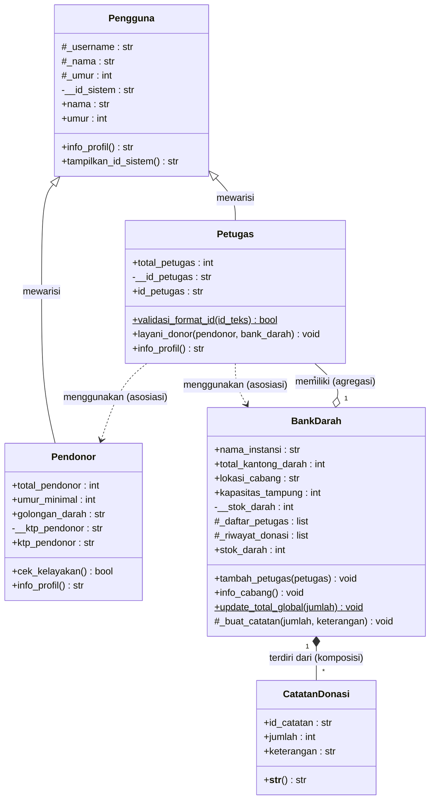

## Daftar Isi

1. [Deskripsi Program](#1-deskripsi-program)
2. [Struktur Proyek](#2-struktur-proyek)
3. [Relasi UML](#3-relasi-uml)
4. [Inheritance](#4-inheritance)
5. [Cara Menjalankan](#5-cara-menjalankan)
6. [Hasil Eksekusi](#6-hasil-eksekusi)

---

## 1. Deskripsi Program

Program ini mensimulasikan proses donor darah pada **Bank Darah Mulawarman**. Sistem terdiri dari beberapa hal:

- **Pengguna**: kelas induk yang menyimpan data umum setiap orang di dalam sistem.
- **Petugas**: pengguna yang bertugas melayani donor dan ditempatkan di cabang bank darah.
- **Pendonor**: pengguna yang mendonorkan darah. Pendonor harus berumur minimal 17 tahun.
- **BankDarah**: cabang tempat stok darah disimpan, lengkap dengan daftar petugas dan riwayat donasi.
- **CatatanDonasi**: catatan setiap penambahan stok darah.

## 2. Struktur Proyek

```
.
├── main.py          # Program utama (simulasi)
├── pengguna.py      # Superclass: Pengguna
├── petugas.py       # Subclass: Petugas
├── pendonor.py      # Subclass: Pendonor
├── bank_darah.py    # Kelas BankDarah dan CatatanDonasi
└── README.md        # Laporan 
```

---




**Cara membaca diagram:**

| Simbol | Relasi | Makna dalam program |
|---|---|---|
| `..>` | Asosiasi | Petugas menggunakan Pendonor dan BankDarah |
| `o--` | Agregasi | BankDarah memiliki Petugas |
| `*--` | Komposisi | BankDarah terdiri dari CatatanDonasi |
| `<\|--` | Pewarisan | Petugas dan Pendonor adalah jenis dari Pengguna |

---

## 3. Relasi

### 5.1 Asosiasi: Petugas menggunakan Pendonor dan BankDarah

**Lokasi:** `petugas.py`, method `layani_donor()`

Objek `Pendonor` dan `BankDarah` hanya **diterima sebagai parameter method** dan dipakai sementara. Keduanya tidak disimpan sebagai atribut `Petugas`, sehingga masing-masing hidup mandiri. Petugas yang sama bisa melayani banyak pendonor dan banyak cabang.

```python
# petugas.py
def layani_donor(self, pendonor, bank_darah):
    print(f"\nPetugas {self._nama} sedang memproses donor atas nama {pendonor.nama}")
    if pendonor.cek_kelayakan():
        try:
            bank_darah.stok_darah = bank_darah.stok_darah + 1
            print(f"Proses donor darah {pendonor.golongan_darah} berhasil dilakukan")
        except ValueError as e:
            print(f"Proses gagal karena {e}")
```

**Pemanggilan di `main.py`:**

```python
petugas1.layani_donor(donor1, bank_pusat)
petugas2.layani_donor(donor2, bank_fakultas)
```

### 5.2 Agregasi: BankDarah memiliki Petugas

**Lokasi:** `bank_darah.py`, atribut `_daftar_petugas` dan method `tambah_petugas()`

Objek `Petugas` **dibuat di luar** `BankDarah` (di `main.py`), lalu dikirim ke bank melalui method. `BankDarah` hanya menampung referensinya di dalam list. Jika objek `BankDarah` dihapus, objek `Petugas` tetap ada.

```python
# bank_darah.py
def __init__(self, lokasi_cabang, kapasitas_tampung):
    ...
    self._daftar_petugas = []    # menampung referensi objek dari luar

def tambah_petugas(self, petugas):
    self._daftar_petugas.append(petugas)
    print(f"Petugas {petugas.nama} ditugaskan di {self.lokasi_cabang}")
```

**Objek dibuat di luar, lalu didaftarkan di `main.py`:**

```python
petugas1 = Petugas("joko_ptg", "Joko Anwar", 35, "PTG-001")   # dibuat di luar
bank_pusat.tambah_petugas(petugas1)                           # dikirim ke penampung
```

### 5.3 Komposisi: BankDarah terdiri dari CatatanDonasi

**Lokasi:** `bank_darah.py`, class `CatatanDonasi`, atribut `_riwayat_donasi`, dan method `_buat_catatan()`

Objek `CatatanDonasi` **dibuat langsung di dalam** `BankDarah`, bukan dikirim dari luar. Catatan tidak punya arti tanpa bank tempat donasi terjadi, dan ikut musnah ketika objek `BankDarah` dihancurkan. Setiap catatan hanya dimiliki satu cabang.

```python
# bank_darah.py
def _buat_catatan(self, jumlah, keterangan):
    id_baru = f"DON-{len(self._riwayat_donasi) + 1:04d}"
    catatan = CatatanDonasi(id_baru, jumlah, keterangan)   # dibuat di dalam induk
    self._riwayat_donasi.append(catatan)
```

Method ini dipanggil otomatis oleh setter `stok_darah` setiap kali stok bertambah:

```python
@stok_darah.setter
def stok_darah(self, jumlah):
    ...
    selisih = jumlah - self.__stok_darah
    if selisih > 0:
        self._buat_catatan(selisih, "Penambahan stok donasi darah")
    self.__stok_darah = jumlah
    BankDarah.update_total_global(selisih)
```

### 5.4 Ringkasan Perbandingan

| Aspek | Asosiasi | Agregasi | Komposisi |
|---|---|---|---|
| Kata kunci | menggunakan | memiliki | terdiri dari |
| Contoh di program | Petugas dan Pendonor | BankDarah dan Petugas | BankDarah dan CatatanDonasi |
| Objek bagian dibuat di | Luar, dikirim lewat parameter | Luar, dikirim ke penampung | Di dalam objek induk |
| Jika induk dihapus | Objek yang dipakai tetap ada | Petugas tetap ada | Catatan ikut musnah |

---

## 4. Inheritance

### 6.1 Superclass dan Subclass

| Peran | Kelas | File |
|---|---|---|
| Superclass | `Pengguna` | `pengguna.py` |
| Subclass 1 | `Petugas(Pengguna)` | `petugas.py` |
| Subclass 2 | `Pendonor(Pengguna)` | `pendonor.py` |

Uji "is-a": **Petugas adalah Pengguna** (benar) dan **Pendonor adalah Pengguna** (benar), sehingga inheritance tepat dipakai. Jenis pewarisan yang digunakan adalah **hierarchical inheritance**: satu superclass diwarisi oleh dua subclass.

### 6.2 Penggunaan `super().__init__()`

Kedua subclass memanggil konstruktor `Pengguna` untuk mengisi atribut bersama (`username`, `nama`, `umur`), lalu hanya mengisi atribut miliknya sendiri.

```python
# petugas.py
def __init__(self, username, nama, umur, id_petugas):
    super().__init__(username, nama, umur)
    self.__id_petugas = None
    self.id_petugas = id_petugas
```

```python
# pendonor.py
def __init__(self, username, nama, umur, golongan_darah, ktp_pendonor):
    super().__init__(username, nama, umur)
    self.golongan_darah = golongan_darah
    self.__ktp_pendonor = None
    self.ktp_pendonor = ktp_pendonor
```

### 6.3 Atribut Tambahan Spesifik Subclass

| Subclass | Atribut spesifik | Keterangan |
|---|---|---|
| `Petugas` | `__id_petugas` | ID petugas, divalidasi harus diawali `PTG` |
| `Pendonor` | `golongan_darah` | Golongan darah pendonor |
| `Pendonor` | `__ktp_pendonor` | Nomor KTP, divalidasi minimal 5 karakter |

Atribut ini tidak dimiliki oleh `Pengguna` maupun subclass lainnya.

### 6.4 Method Overriding

Method `info_profil()` milik `Pengguna` ditimpa di kedua subclass dengan perilaku yang berbeda: menambahkan label peran dan atribut khusus masing-masing.

```python
# pengguna.py (versi superclass)
def info_profil(self):
    return f"Username: {self._username} | Nama: {self._nama}, Umur: {self._umur} tahun"
```

```python
# petugas.py (override)
def info_profil(self):
    return f"[Petugas] {self._nama} (@{self._username}) dengan ID: {self.id_petugas}"
```

```python
# pendonor.py (override)
def info_profil(self):
    return f"[Pendonor] {self._nama} (@{self._username}) | Gol Darah: {self.golongan_darah} | KTP: {self.ktp_pendonor}"
```

Pemanggilan di `main.py` memperlihatkan perilaku yang berbeda dari satu nama method yang sama:

```python
print(petugas1.info_profil())   # [Petugas] Joko Anwar (@joko_ptg) dengan ID: PTG-001
print(donor1.info_profil())     # [Pendonor] Senku (@senku123) | Gol Darah: O | KTP: 98712
```

### 6.5 Tingkat Akses: Protected dan Private

**Protected (`_`)** dipakai untuk data yang perlu diakses langsung oleh subclass.

```python
# pengguna.py
self._username = username
self._nama = nama
self._umur = umur
```

Subclass langsung memakainya, misalnya `self._nama` dan `self._username` di `info_profil()`, serta `self._umur` di `Pendonor.cek_kelayakan()`.

**Private (`__`)** dipakai untuk data yang benar-benar rahasia milik superclass.

```python
# pengguna.py
self.__id_sistem = f"SYS-{id(self)}"

def tampilkan_id_sistem(self):
    return self.__id_sistem
```

`__id_sistem` mengalami *name mangling* menjadi `_Pengguna__id_sistem`, sehingga subclass tidak bisa mengaksesnya secara langsung. Atribut ini hanya bisa dibaca lewat method milik `Pengguna` sendiri, yaitu `tampilkan_id_sistem()`.

**Akses dari luar kelas** tetap aman lewat property read-only yang didefinisikan sekali di superclass dan diwarisi kedua subclass:

```python
# pengguna.py
@property
def nama(self):
    return self._nama

@property
def umur(self):
    return self._umur
```

### 6.6 Ringkasan Pemenuhan Ketentuan

| Ketentuan | Status | Lokasi |
|---|---|---|
| Minimal 1 superclass | Terpenuhi | `Pengguna` di `pengguna.py` |
| Minimal 2 subclass | Terpenuhi | `Petugas` dan `Pendonor` |
| Memakai `super().__init__()` | Terpenuhi | `__init__` pada kedua subclass |
| Atribut tambahan tiap subclass | Terpenuhi | `__id_petugas`; `golongan_darah` dan `__ktp_pendonor` |
| Method overriding | Terpenuhi | `info_profil()` pada kedua subclass |
| Atribut protected | Terpenuhi | `_username`, `_nama`, `_umur` |
| Atribut private | Terpenuhi | `__id_sistem` |

---

## 5. Cara Menjalankan

```bash
# 1. Clone repositori
git clone <url-repositori-anda>
cd <nama-folder-repositori>

# 2. Jalankan program
python main.py
```

---

## 6. Hasil Eksekusi

Skenario di `main.py`:

- Dua cabang dibuat: **Cabang Pusat** (kapasitas 100) dan **Cabang Fakultas** (kapasitas 5).
- Dua petugas ditugaskan, satu di setiap cabang.
- Pendonor **Senku (19 tahun)** dilayani di Cabang Pusat dan lolos pemeriksaan.
- Pendonor **Kohaku (16 tahun)** dilayani di Cabang Fakultas dan ditolak karena di bawah umur minimal 17 tahun.

**Output:**

```
Petugas Joko Anwar ditugaskan di Cabang Pusat
Petugas Yoga Ananda ditugaskan di Cabang Fakultas
[Petugas] Joko Anwar (@joko_ptg) dengan ID: PTG-001
[Pendonor] Senku (@senku123) | Gol Darah: O | KTP: 98712

Petugas Joko Anwar sedang memproses donor atas nama Senku
Proses donor darah O berhasil dilakukan

Petugas Yoga Ananda sedang memproses donor atas nama Kohaku
Maaf Kohaku, umur pendonor minimal 17 tahun
Stok Tersedia: 1/100 kantong
Total Petugas: 1 orang
Riwayat Donasi:
[DON-0001] +1 kantong | Ket: Penambahan stok donasi darah
Stok Tersedia: 0/5 kantong
Total Petugas: 1 orang
Riwayat Donasi:
Belum ada riwayat masuk
SYS-140608997783840
```

> Angka pada baris terakhir (`SYS-...`) berasal dari `id(self)` dan akan berbeda setiap program dijalankan.

**Analisis output:**

| Baris output | Penjelasan |
|---|---|
| `Petugas ... ditugaskan di ...` | Agregasi: petugas dari luar didaftarkan ke bank |
| `[Petugas] ...` dan `[Pendonor] ...` | Method overriding: `info_profil()` berbeda untuk tiap subclass |
| `Proses donor darah O berhasil dilakukan` | Asosiasi: petugas memakai objek pendonor dan bank lewat parameter |
| `Maaf Kohaku, umur pendonor minimal 17 tahun` | Validasi kelayakan pada `Pendonor.cek_kelayakan()` |
| `Stok Tersedia: 1/100 kantong` dan `[DON-0001] ...` | Komposisi: catatan dibuat otomatis di dalam `BankDarah` |
| `Belum ada riwayat masuk` | Cabang Fakultas tidak menerima donor, sehingga tidak ada catatan |
| `SYS-...` | Atribut private `__id_sistem` dibaca lewat method superclass |

---